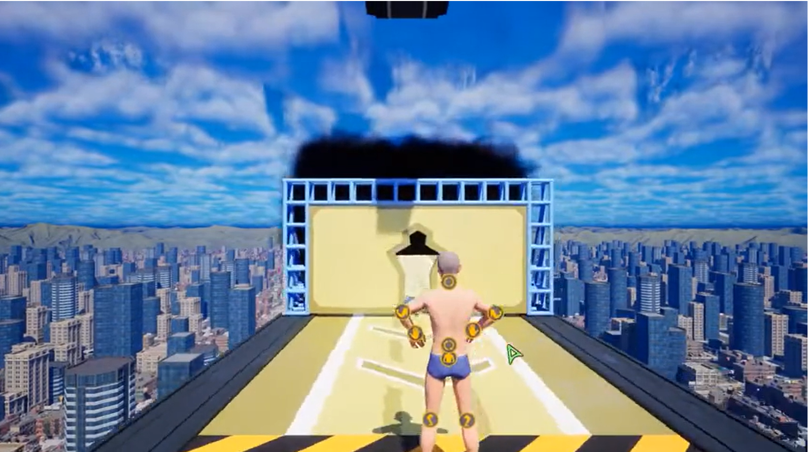
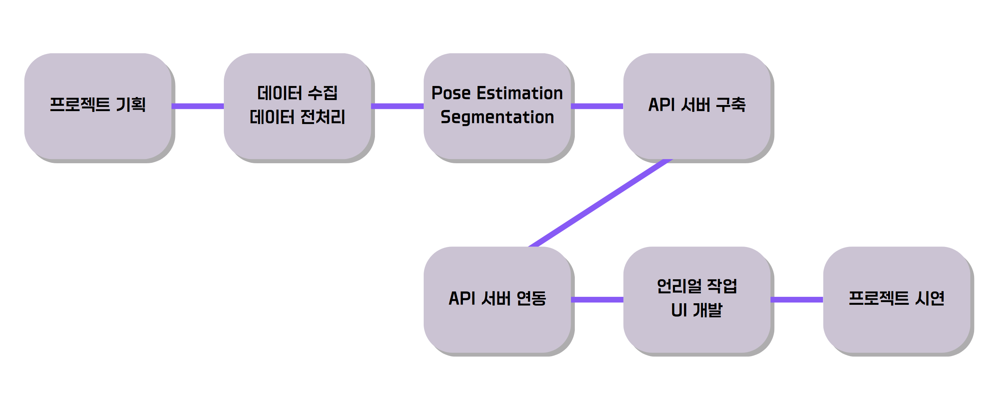
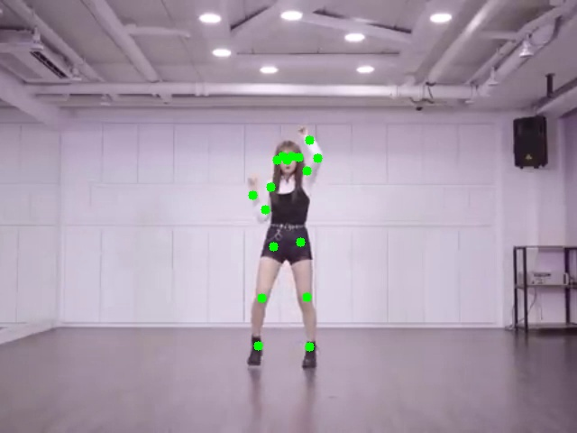
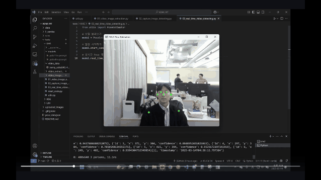
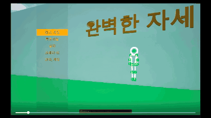
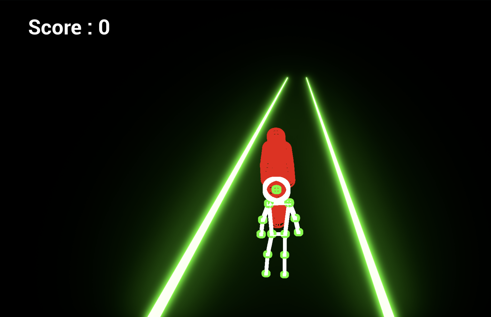

# Perfect Pose <완벽한 자세>
## 플레이어의 자세를 실시간으로 인식·분석하여, 게임에서 제시하는 자세를 동일하게 따라 했을 경우 Score를 득점하는 게임

### **역할 구성**  
- AI Engineer: 김형섭, 김상겸, 이장헌  
- Unreal Developer: 이상민, 장진혁, 이득구

### **프로젝트 기간**
- 2025.03.13 ~ 2025.03.14 (이틀)

## 1. 프로젝트 개요
“Perfect Poses(완벽한 자세)” 프로젝트는 Steam의 Perfect Poeses를 Reference로 하여, AI·Data Engineer 팀과 Unreal Engine5 개발 팀이 협업하여 만든 AI 기반 실시간 자세 인식 게임입니다.
### Reference Game Image 
  
- <a href="https://www.canva.com/design/DAGhq0A3PgA/W_15JDo5rMgD3zp_HcPNtw/view?utm_content=DAGhq0A3PgA&utm_campaign=share_your_design&utm_medium=link2&utm_source=shareyourdesignpanel"> 프로젝트 발표 자료 </a>

---

## 2. 주요 기능
1. **데이터 수집 및 전처리**  
   - 비디오·이미지에서 사용자 프레임 추출  
   - 크롭 & 좌표 정규화 → 월드 좌표계 변환 
2. **Pose Estimation**  
   - Ultralytics YOLO-Pose 모델 적용  
   - 정적/실시간 영상에서 관절 위치 검출 및 데이터셋 생성  
3. **Segmentation (SAM)**  
   - Meta AI의 Segment Anything Model 사용  
   - 객체 마스크 생성 및 좌표값 추출  
4. **API 서버 (FastAPI)**  
   - 비동기 RESTful API로 자세 데이터 송수신  
   - JSON 기반 통신, 싱글톤 패턴 구현  
5. **언리얼 엔진 연동 & UI 개발**  
   - REST API 호출로 DrawDebugLine 기반 실시간 자세 표시  
   - Level Sequence 활용한 2.5D 시네마틱 연출  
   - Debug Trace Line을 이용한 벽 충돌 여부 판정  

---

## 3. 기술 스택
<table style="width:100%; border-collapse: collapse;" border="1">
  <thead>
    <tr>
      <th style="padding: 8px; text-align: left;">분류</th>
      <th style="padding: 8px; text-align: left;">주요 기술 · 라이브러리</th>
    </tr>
  </thead>
  <tbody>
    <tr>
      <td style="padding: 8px;"><strong>AI·데이터</strong></td>
      <td style="padding: 8px;">Python, OpenCV, Ultralytics YOLO-Pose, SAM (Meta AI)</td>
    </tr>
    <tr>
      <td style="padding: 8px;"><strong>백엔드</strong></td>
      <td style="padding: 8px;">FastAPI, Uvicorn, Pydantic, REST, JSON</td>
    </tr>
    <tr>
      <td style="padding: 8px;"><strong>게임 엔진</strong></td>
      <td style="padding: 8px;">Unreal Engine 5, C++, Blueprint</td>
    </tr>
    <tr>
      <td style="padding: 8px;"><strong>협업 도구</strong></td>
      <td style="padding: 8px;">GitHub, Git (버전 관리)</td>
    </tr>
  </tbody>
</table>

---

## 4. 사용자 시나리오
1. 사용자가 게임을 실행  
2. 게임 실행시 웹캠이 AI 서버에 실시간 영상 스트리밍 시작  
3. 서버에서 YOLO Model로 위치 및 마스크 정보 수신
4. 게임 화면에 실시간 자세 라인 및 점수 피드백 표시
5. 사전에 만들어 둔 정답 Pose 데이터를 기반으로 게임 시작
6. 기준 자세와의 일치도에 따라 다음 단계(레벨) 진행 또는 보상 지급  

---

## 5. 개발 과정 (AI)
### 프로젝트 개발 Process

### <strong>Pose Detection 개발</strong>

### Segmentation 개발

### FastAPI를 활용한 Backend Server 구축

---

## 6. 서비스 화면 
### Unreal Engine 게임 플레이 화면
  
### 실시간 자세 분석 UI 
  

---

## 7. 향후 개발 방향 (옵션)
- 고급 자세 교정 알고리즘 도입  
- 멀티플레이 경쟁 모드 확장  
- 사용자 커스터마이즈 캐릭터 및 애니메이션 추가

## 8. 문의
- 이메일 : yyahoo1233@naver.com
